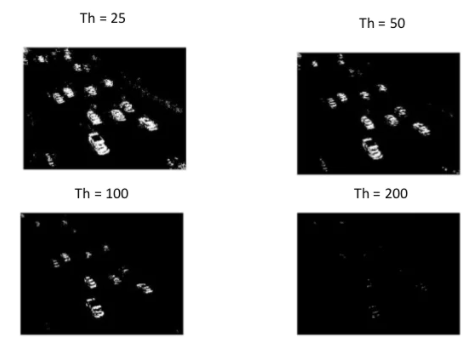

# Day 3

## Introduction

Today, we will take another step in our overall goal of creating a smart security system. Through our camera feed, we want to determine whether there is someone (or something) in the frame. To do this, we will use our knowledge of `OpenCV` to detect motion.


How do we achieve this?

Well, first we need a way to stream the camera feed. In the past, we were successful in capturing still images from the camera, and even showed a preview of the feed for a few seconds. But we need a way to access the camera feed in a Python script.

We would then need to figure out a way to detect any motion in the stream. We'll get back to this later, but for now, think of some ideas in how we can detect motion. Think about what exactly is "motion" in terms of a stream of images. After all, a video is just a set of still images that you view in rapid succession.

## 1. Steady Camera Stream

First things first, lets stream the camera in Python. To do this, we will need the `picamera` module. Run the following in the terminal to download the neccessary packages:
```bash
$ python3 -c "import picamera"
```
### a) Access Single Images

Lets start by accessing a single image from the camera stream. Create a new Python file called `motion_detection.py`

First, import the required libraries

``` Python
# import the necessary packages
from picamera.array import PiRGBArray
from picamera import PiCamera
import time
import cv2
```

We then need to initialize a camera by calling `PiCamera()`. This will give us a reference to the raw camera capture component. The `raw_capture` object is especially useful since it gives us direct access to the camera stream and avoids the expensive compression to JPEG format, which we would then have to take and decode to `OpenCV` format anyway.

Let's also change the camera resolution to `640x480` pixels. This dimension is arbitrary, but it will standardize our outputs later on.
``` Python
camera = PiCamera()
camera.resolution = (640, 480)
raw_capture = PiRGBArray(camera, size=(640, 480))
time.sleep(0.1) # allow time for the camera to warmup
```

Next, we will capture a frame by calling `capture()` on the camera object we previously created. Be aware that the format is `BGR` and not the traditional `RGB`. This is extremely important because `OpenCV` represents images as `Numpy` arrays in `BGR` order rather than `RGB`. This little nuisance is subtle, but very important to remember as it can lead to some confusing bugs in your code down the line.


``` Python
# grab an image from the camera
camera.capture(raw_capture, format="bgr")
image = raw_capture.array
```

Now, lets display the image on the screen by using `cv2.imshow()`. 
``` Python
cv2.imshow("Image", image)
cv2.waitKey(0)
```

Test that this is working by running
``` bash
$ python3 motion_detection.py
```

### b) Constant Streaming

Now that we have successfully used `OpenCV` to grab a single image from the camera, lets move on to a video stream.

The concept is similar to how we got a single image above. But instead of calling `capture` on the camera object, we will call `capture_continuous` instead. Intuitive right?

But in order to process each indivdual frame in this continuous stream, we will need a for loop:

``` Python
for frame in camera.capture_continuous(raw_capture, format="bgr", use_video_port=True):
    image = frame.array
```

The `capture_continuous` method returns a frame from the video stream. The frame then has an array property, which corresponds to the frame in `Numpy` array format. So, in order to get the image frame itself, we have to call `frame.array` to get the `Numpy` array representation of the image.

Also, within the loop, we have to clear the `raw_capture` stream to get ready for the next frame.
``` Python
raw_capture.truncate(0)
raw_capture.seek(0)
```

In summary, you should have the following code in `motion_detection.py`

``` Python
from picamera.array import PiRGBArray
from picamera import PiCamera
import time
import cv2
# initialize the camera and grab a reference to the raw camera capture
camera = PiCamera()
camera.resolution = (640, 480)
raw_capture = PiRGBArray(camera, size=(640, 480))
# allow the camera to warmup
time.sleep(0.1)

# capture frames from the camera
for frame in camera.capture_continuous(raw_capture, format="bgr", use_video_port=True):
	# grab the raw NumPy array representing the image, then initialize the timestamp
	# and occupied/unoccupied text
	image = frame.array
	# show the frame
	cv2.imshow("Frame", image)
	key = cv2.waitKey(1) & 0xFF
	# clear the stream in preparation for the next frame
	raw_capture.truncate(0)
    raw_capture.seek(0)
	# if the `q` key was pressed, break from the loop
	if key == ord("q"):
		break
```

To run this program, go to the terminal and execute
``` bash
$ python3 motion_detection.py
```

## 2. What's the Difference?

Now, lets revisit our initial question. How do we detect motion within a camera stream? Hint: think of the camera stream as a series of image frames that are just shown in rapid succession.


What exactly is "motion" anyways? In the example above, we see that there are minor differences between each frame. If you mut all of these minor differences together, you get "motion".


Today, we will explore what it means to use background subtration between frames to detect motion.

### What is Background Subtraction

Background subtraction is critical in many computer vision applications. We use it to count the number of cars passing through a toll booth. We use it to count the number of people walking in and out of a store.

And we will now use it for motion detection.

The base in this approach is that of detecting moving objects from the difference between the current frame and reference frame, which is often called ‘Background Image’ or ‘Background Model’. This background subtraction is typically done by detecting the foreground objects in a video frame and foreground detection is the main task of this whole approach.  

Any robust background subtraction model should be able to handle light intensity changes, repeated motion from long term scene changes. The analysis of such an approach mathematically can be modelled using a function `P(x,y,t)` as a video sequence where `t` is the time dimensions `x` and `y` are the pixel locations. 


Mathematically it can be modelled as;
```
| Framei  – Framei-1 | > Threshold
```

The estimated background using the Frame Difference approach is just the previous frame estimated by the above empirical way. This approach can be used when segment motion-based objects such as cars, pedestrians etc. 

And it is very sensitive to threshold values. So depending on object structure, speed, frame rate and global threshold limit this approach has limited use cases.



We will use background subtraction to detection motion because the background of our video stream is largely static and unchanging over consecutive frames of a video. Therefore, if we can model the background, we monitor it for substantial changes. If there is a substantial change, we can detect it — this change normally corresponds to motion on our video.

### Implement Background Subtraction

Lets go back to our previous `motion_detection.py` file.

We will first need to augment the incoming images. Let's convert the image to grayscale and apply Gaussian blurring to smooth our images.

``` Python
gray = cv2.cvtColor(image,cv2.COLOR_BGR2GRAY)
gray = cv2.GaussianBlur(gray,(21,21),0)
```

Due to tiny variations in the digital camera sensors, no two frames will be 100% the same — some pixels will most certainly have different intensity values. That said, we need to account for this and apply Gaussian smoothing to average pixel intensities across an 21 x 21 region. This helps smooth out high frequency noise that could throw our motion detection algorithm off.

We will need to store the first image input as the reference frame.

``` Python
if reference_frame is None:
    reference_frame = gray
    continue
```

Here, if we see that there is currently no reference frame, we will use the image input as the reference frame and continue on to the next frame.

Now that we have our background modeled via the `reference_frame` variable, we can utilize it to compute the difference between the initial frame and subsequent new frames from the video stream.

Lets compute the absolute difference between the current frame and the reference frame.
``` Python
frame_delta = cv2.absdiff(last_frame,gray)
thresh = cv2.threshold(frame_delta, 25, 255, cv2.THRESH_BINARY)[1]
```
This will take the pixel density difference between the current and reference frames using the following formula:
```
delta = |reference_frame – current_frame|
```

Now, we can use `cv2.threshold` to reveal regions of the image that only have significant changes in pixel intensity values. If the delta is less than 25, we discard the pixel and set it to black (i.e. background). If the delta is greater than 25, we’ll set it to white (i.e. foreground).

It will look something like this


Given this thresholded image, it’s simple to apply contour detection to to find the outlines of these white regions.

``` Python
cnts = cv2.findContours(thresh.copy(), cv2.RETR_EXTERNAL, cv2.CHAIN_APPROX_SIMPLE)
cnts = imutils.grab_contours(cnts)
```

We will now loop over each of the contours, where we’ll filter the small, irrelevant contours. If the contour area is larger than a pre-determined `min_area` value, we’ll draw the bounding box surrounding the foreground and motion region.

```Python
for c in cnts:
        if cv2.contourArea(c) < min_area:
            continue
        (x,y,w,h) = cv2.boundingRect(c)
        cv2.rectangle(image,(x,y),(x+w,y+h), (0,255,0),2)
```

And that is all! We have just detected motion!

To review, here is what we accomplished:

1. use the first frame in the camera feed as the reference frame
2. process each frame in a constant camera feed against the reference frame
3. each frame is converted to grayscale and a Gaussian blur was applied (can you remember why the Gaussian filter was needed?)
4. take the difference in pixel density between the reference frame and each subsequence frame
5. find the "contours", where there is a obvious difference in pixel density (above a given threshold)
6. for each contour, if it is larger than a pre-determined min_area threshold, draw a bounding box to label it as detected motion


### Wrapping Up

To wrap up, lets visualize everything we have computed above using `cv2.imshow`.

First, lets show whether motion was or was not detected, along with the date.
``` Python
cv2.putText(image, "Motion: {}".format(maybe_motion_text), (10,20), cv2.FONT_HERSHEY_SIMPLEX, 0.5, (0,0,255),2)
cv2.putText(image, datetime.datetime.now().strftime("%A %d %B %Y %I: %M: %S%p"), (10,image.shape[0]-10), cv2.FONT_HERSHEY_SIMPLEX, 0.35,(0,0,255),1)
```

Here, we use a `maybe_motion_text` variable to store whether there was motion. Think about where you need to initalize this variable and when to change it in your code. If you need help, look to the full code script below.

Now, lets open up three windows.

``` Python
cv2.imshow("Feed", image)
cv2.imshow("Threshold", thresh)
cv2.imshow("Frame Delta", frame_delta)
```

The first window will be our image (with bounding boxes around any detected motion). We will also open windows to show the frame delta and thresholded images (just for fun :D).

Finally, lets wait for an escape key to be pressed in order to exit out of the infinite loop.

``` Python
if key == ord("q"):
        break
```

### Full Python Program

``` Python
from picamera.array import PiRGBArray
from picamera import PiCamera
import imutils
import time
import cv2

camera = PiCamera()
camera.resolution = (640, 480)
raw_capture = PiRGBArray(camera, size=(640, 480))
time.sleep(1)
reference_frame = None

min_area = 15

for frame in camera.capture_continuous(raw_capture, format="bgr", use_video_port=True):
    image = frame.array
    raw_capture.truncate()
    raw_capture.seek(0)
    
    maybe_motion_text = "Not Detected"
    if image is None:
        break

    gray = cv2.cvtColor(image,cv2.COLOR_BGR2GRAY)
    gray = cv2.GaussianBlur(gray,(21,21),0)

    if reference_frame is None:
        reference_frame = gray
        continue
        
    frame_delta = cv2.absdiff(reference_frame,gray)
    thresh = cv2.threshold(frame_delta, 25,255,cv2.THRESH_BINARY)[1]
    
    thresh = cv2.dilate(thresh,None,iterations=2)
    cnts = cv2.findContours(thresh.copy(), cv2.RETR_EXTERNAL,
            cv2.CHAIN_APPROX_SIMPLE)
    cnts = imutils.grab_contours(cnts)
        
    for c in cnts:
        if cv2.contourArea(c) < min_area:
            continue
        (x,y,w,h) = cv2.boundingRect(c)
        cv2.rectangle(image,(x,y),(x+w,y+h), (0,255,0),2)
        maybe_motion_text = "Detected"
        
    cv2.putText(image, "Motion: {}".format(maybe_motion_text), (10,20), cv2.FONT_HERSHEY_SIMPLEX, 0.5, (0,0,255),2)
    cv2.putText(image, datetime.datetime.now().strftime("%A %d %B %Y %I: %M: %S%p"), (10,image.shape[0]-10), cv2.FONT_HERSHEY_SIMPLEX, 0.35,(0,0,255),1)
        
    cv2.imshow("Feed", image)
    cv2.imshow("Threshold", thresh)
    cv2.imshow("Frame Delta", frame_delta)
    key = cv2.waitKey(1) & 0xFF

    if key == ord("q"):
        break

cv2.destroyAllWindows()
```