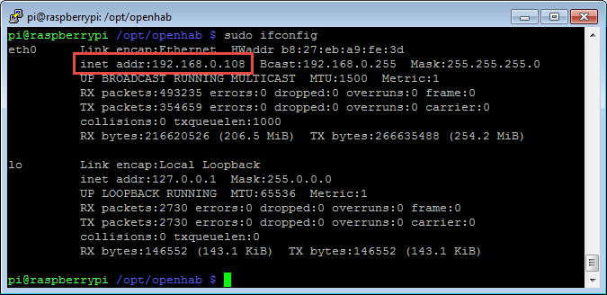
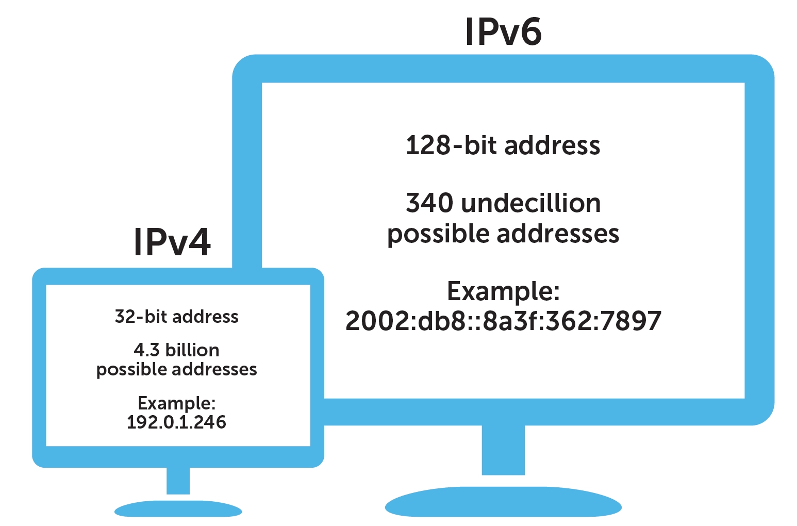

# Day 4

## Introduction

### a) What is a Web Server?

In a nutshell, a web server is both the hardware and software required to create a website that you can access via the Internet.

For example, if you go to `amazon.com`, a request is made from your computer to a server owned by Amazon. The returned result is what you see on your screen. If you want to access any piece of data/information through the Internet, that data/information must be stored somewhere and there must be some sort of software to help you access it.

On the hardware side, a web server is a computer that stores web server software and a website's component files (for example, HTML documents, images, CSS stylesheets, and JavaScript files). A web server connects to the internet and supports physical data interchange with other devices connected to the web.

On the software side, a web server includes several parts that control how web users access hosted files.

### b) How Does Your Browser Know What to Show?

This is where HTTP requests come in. HTTP (Hypertext Transfer Protocol) is a protocol (or set of rules) that specifies how hypertext (linked web documents) are transferred to and from the web server. 

At the most basic level, whenever a browser needs a file that is hosted on a web server, the browser requests the file via HTTP. When the request reaches the correct (hardware) web server, the (software) HTTP server accepts the request, finds the requested document, and sends it back to the browser, also through HTTP.


What are some examples of requests made from a browser to a web server?

1. when you type in `amazon.com`, a request is made for the contents of the main page. The response are files (HTML/CSS, etc.) that specify to the browser how and what to display.

2. every query (or question) you type into `Google` is a request made to the Google servers. The request includes your query string. Your browser will then receive back a response that consists of a list of relavent links.

3. every video you watch on `YouTube` requires HTTP requests. Your browser requests the video from YouTube's servers and once it is received, you can view it on your screen.


### c) Types of HTTP Requests

Now that we know how our browser can receive data from any web server, how do we contribute to the web? 

Everyday, over 95 million photos and videos are shared on Instagram. There's also 720,000 hours of video being uplaoded to YouTube on the daily. Let's look at the technical mechanics of how these pieces of media is posted onto the internet for everyone to see.

Above, we discussed how your browser loads data. They do it by `GET`ting data from a web server. Now, when you want to post a new Instagram post, your browser will need to `POST` to the web server. What about when you want to edit a caption? Well, that's a `PUT` request. And when you decide that your post is no longer relavent, you can `DELETE` from the web server.

Lets summarize. Here are the most common HTTP requests. There are others like `PATCH` or `OPTIONS`, but we will not cover them here.

#### GET

The HTTP `GET` method is used to **read** (or retrieve) a representation of a resource. `GET` requests are only for reading data, and not changing it.

#### POST

The `POST` verb is most-often utilized to **create** new resources.

#### PUT

`PUT` is most-often utilized for **update** capabilities, PUT-ing to a known resource URI with the request body containing the newly-updated representation of the original resource.

#### DELETE

`DELETE` is pretty easy to understand. It is used to **delete** a resource identified by a URI.

### d) Putting it All Together

Here is an example of a HTTP request:


It starts with a **method** (a verb we learned about above), followed by the path to the resource to fetch. An example of a path is `google.com` or `instagram.com/illinoiscs`. Then, we will specify the vertion of the HTTP protocol we want to use (don't worry about this for now). And finally, any optional headers we want to send to the server is included.

Next, here is an example of a response from the server:


We will not go into details about the response format, but feel free to do some extra reading on your own!

The only thing is note is the `Content-Type`. The server can respond with a myriad of different data types, including `text/html` for textual results, `image/jpeg` for images, `video/mp4` for videos.

### e) All About Flask

Now that we know about how web servers work, let's discuss how we can create one ourselves using Python.

Flask is a web framework in Python. This means flask provides you with tools, libraries and technologies that allow you to build a web application. This web application can be some web pages, a blog, a wiki or go as big as a web-based calendar application or a commercial website.

We will start by writting a `"Hello World"` application in Flask.

To begin, we will need to create a new folder to store our web application.

``` bash
$ mkdir -p hello_flask/{templates,static}
```

This will create the following structure. The `hello_fask/` folder is the root folder of our web app and there are 2 subfolders inside.

``` bash
hello_flask/
|-- static
|-- templates
```

The `templates/` folder is the place where the templates will be put. The `static/` folder is the place where any files (images, css, javascript) needed by the web application will be put. These two folders define what the frontend of the web app will look like.

Now, inside of `hello_fask/` we will create the server file. This is the "backend" of our app. Think of the backend as where all of the HTTP requests are processed and what response is sent back.

Create a `main.py` inside of `hello_flask/`.

Inside of `main.py`, we will first need to import flask. Then, we create the application.

``` Python
import flask

app = Flask(__name__)

if __name__ == '__main__':
    app.debug=True
    app.run()
```

Perfect. Now you have a flask app! But as you've probably already guessed, our app doesn't do anything. We need to create accessible routes.

``` Python
@app.route('/')
def index():
    """ Displays the index page accessible at '/'
    """
    return flask.render_template('index.html')
```

What this method does is whenever someone goes to the uri `/`, it will render `index.html`.

App routing means mapping the urls to a specific function that will handle the logic for that url. For example, in our Python code, we defined the route `/` for the method called `index()`. This means whenever someone goes to `www.example.com/`, the function `index()` is run and whatever is the `return` of that method also gets returned to the browser.

Similarly, if you defined the route `/hello` for a method called `hello_func`, then whenever someone accesses `www.example.com/hello`, the `hello_func` is called.

Now, let's create a simple `index.html` that displays `"Hello World"`. Inside of `templates/`, create a new file called `index.html`.

Inside, let's put 
``` HTML
<!DOCTYPE html>
<html lang='en'>
<head>
  <meta charset="utf-8" />
  <title>Hello world!</title>
  <link type="text/css" rel="stylesheet"
        href="{{ url_for('static',
              filename='hello.css')}}" />
</head>
<body>

It works!

</body>
</html>
```

Now we can run our web app! 

``` bash
$ python hello_flask.py
```

Now in your browser, navigate to `http://127.0.0.1:5000/` and you should see the following


### f) A Little Bit on IP Addresses and Ports

Now you might be wondering why the url we typed in is a series of numbers. This has to do with IP. IP stands for "Internet Protocol," which is the set of rules governing the format of data sent via the internet or local network. In essence, IP addresses are the identifier that allows information to be sent between devices on a network: they contain location information and make devices accessible for communication.

Every device has its own IP address. You can find the IP address of your Raspberry Pi by running `ifconfig` in the terminal. In the printout, find `etho0` and the numbers after `inet address` is your IP address!



IP addresses are very useful. If I wanted to access a file on your computer, I would first need to know your IP address (and then get to hacking). If I wanted to send you a file, I would also need to know your IP address so that the file is sent to the right device.

There is a lot to know when it comes to IP address, and since it is simply a protocol (a set of rules), the protocol can change. There are currently two forms of IP address: IPv4 and IPv6. There is no need to know much about them, but the main differences are defined below.



When the internet was first created, IPv4 was sufficient in identifying all devices on the network. But as the internet grew, we soon realized that there is not enough unique identifiers! So IPV6 was introduced so that each device can have its own unique address.

For now, we will stick with IPv4 address, which is a string of 4 numbers (between 0 and 255) separated by periods. So, the full IP addressing range goes from 0.0.0.0 to 255.255.255.255.

There is one special address you should remember that that is `127.0.0.1`. This is known as your localhost (or home). You might have even seen memes online like this:


and now you know what it means! When you ran the flask server, you can access it locally (on the same computer) by going to `http://127.0.0.1`. Try going to the same address on your phone and you'll find that there is nothing there.

That is because to access a server on the same network, you must go to its IP address. So for example, if I run the flask server on my Raspberry Pi which has an IP address of `192.168.0.108`, I can go on my phone (that's connected to the same Wi-Fi network) and type in `http://192.168.0.108:5000` to see the web app you just created.

### g) Where Did the `:5000` Come From?

As you have noticed, you cannot simply go to `http://192.168.0.108` to access the web app. You have to go to `http://192.168.0.108:5000`. This is because your web app is run on port 5000.

Not only do you have to know a server's IP address, you also have to know which port the server is run on.

Imaging you want to run two web apps at the same time on the same machine. How do you do that? If you go to `http://192.168.0.108`, which web page should be shown? That is why we need ports. By default flask servers are run on port 5000 (but you can change that if you want). If you tried running a different web app at the same time, you will need to specify a different port number (lets say 5001). Then, to access the first webpage, you can go to `http://192.168.0.108:5000` and to access the second, you can go to `http://192.168.0.108:5001`.

Phew we're finally done with the introduction. Lets move on to creating a web app for your smart doorbell system!

## Who's At the Door?

In reality, a smart doorbell is not very smart if you don't know who is there. That's why today we will create a web app that allows you to stream the camera feed from another device!

By the end of today, you will be able to open your phone and see what your camera sees.

Let's get started.

### a) Setting up Flask

Like before, we need to create a new project folder. Lets call it `camera_streamer/`

``` bash
$ mkdir -p camera_streamer/{templates,static}
```

This should create the following directory structure:
``` bash
camera_streamer/
|-- static
|-- templates
```

Now, lets create the server file. Inside the `camera_streamer/` folder, create a new file called `main.py`.

Inside, we will use the following starter code:

``` Python
from flask import Flask, render_template, Response

app = Flask(__name__)

@app.route('/')
def index():
    return render_template('index.html')

if __name__ == '__main__':
    app.debug=False
    app.run()
```

Then, create `index.html` inside of `templates/` with the following code:

``` HTML
<!DOCTYPE html>
<html lang='en'>
<head>
  <meta charset="utf-8" />
  <title>Hello world!</title>
  <link type="text/css" rel="stylesheet"
        href="{{ url_for('static',
              filename='hello.css')}}" />
</head>
<body>
</body>
</html>
```

### b) Creating the UI

Next, lets create the main web page with a placeholder for the video feed.

Navigate to `index.html`.

Inside the `<body></body>` tags, add the following:

``` HTML
<div class="main" id="newpost">
    
</div>
```

Here, we are creating a `div`. In HTML, `div`s are divisions or sections, and is mainly used to create containers for other elements.

Inside this division, we are creating an `img` (image) element. We initialize this element with several visual (or `style`) attributes. First, we say that the `width` and `height` should be `100%` of its parent container. Then, the `background-attachment` should have a fixed position (no need to worry about what this means). We need to specify a `src` (or source) for this image. The `src` is how the browser knows where to look for the image before its able to display it.

Here, the source of the image we want to display is dynamically set. In flask, we can use `url_for` to specify a route that will supply the image. Here, that route is `/video_feed`.

### c) A New Route

In `index.html`, we specified the route `/video_feed`. Now we must add functionality to this route on the backend.

Open `main.py`.

Inside, we will add a new method for this route.

``` Python
@app.route('/video_feed')
def video_feed():
    return None
```

To get the video feed, we first need to setup the camera (like we did before).

``` Python
from picamera.array import PiRGBArray
from picamera import PiCamera

camera = PiCamera()
camera.resolution = (640, 480)
raw_capture = PiRGBArray(camera, size=(640, 480))
```

Now, lets create a helper function to get the frame. This is also exactly what we have done before.

``` Python
def get_feed(camera):
    #get camera frames
    for frame in camera.capture_continuous(raw_capture, format="bgr", use_video_port=True):
        image = frame.array
        _, image = cv2.imencode(".jpg", image)
        raw_capture.truncate()
        raw_capture.seek(0)
        yield (b'--frame\r\n'
               b'Content-Type: image/jpeg\r\n\r\n' + image.tobytes() + b'\r\n\r\n')
```

Here, we loop through all of the frames in a continuous capture feed. Then, we must convert the frame to bytes. To do so, we must first use `OpenCV` to encode it into a jpg using `cv2.imencode`. Next, we will convert it into bytes using the `tobytes()` function.

Finally, we want to send the frame as an image in the response. Remember that when we learned about HTTP requests and responses, the response can be on various types. To send an image response back to the end, we will define the `Content-Type` to be `image/jpeg`.

Now that we have a helper function that returns each frame, let's go back to `video_feed()`. Here, we want to have flask help us respond to the request. Flask has a `Response()` method for this reason. Without having to worry too much about what this built-in function does, we will use it in `video_feed` to return a constant stream of image frames to the client.

The final `video_feed()` function should look like this:

``` Python 
@app.route('/video_feed')
def video_feed():
    return Response(get_feed(camera),
                    mimetype='multipart/x-mixed-replace; boundary=frame')
```

And that's it! You have just created a web app using Flask that streams the feed of the camera attached to your Raspberry Pi. To execute this, go to the terminal and run
``` bash
$ python main.py
```

Now, if you visit `http://127.0.0.1:5000` on your Raspberry Pi, you should see a real-time stream of your camera! 

To access this page from your phone, you will need the IP address of your Raspberyy Pi (revisit how to do so above). Make sure your phone is on the same Wi-Fi network as your Raspberry Pi. Then all you need to do is visit `http://<Raspberry Pi's IP>:5000` on your device!
